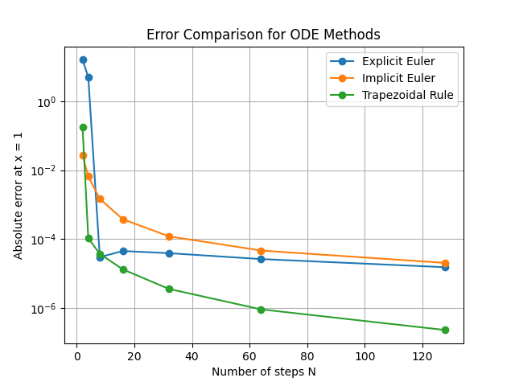

# ODE Stability: Euler and Trapezoidal Methods

This folder contains a Python implementation comparing three numerical methods for solving the model ordinary differential equation

$$
y' = \lambda y, \quad y(0)=1, \quad x \in [0,1].
$$

In this experiment, we use

$$
\lambda = -10.
$$

The exact solution is

$$
y(x)=e^{\lambda x}.
$$

Therefore, at \(x=1\),

$$
y(1)=e^{-10}.
$$

## Methods

The following methods are implemented:

1. Explicit Euler Method
2. Implicit Euler Method
3. Trapezoidal Rule

For different values of \(N\), the interval \([0,1]\) is divided into \(N\) equal steps, so the step size is

$$
h = \frac{1}{N}.
$$

The program compares the numerical approximation of \(y(1)\) with the exact value and prints the absolute error.

## Numerical Formulas

### Explicit Euler Method

$$
y_{n+1} = (1+h\lambda)y_n
$$

This method is simple, but it may become unstable when the step size is too large.

### Implicit Euler Method

$$
y_{n+1} = \frac{y_n}{1-h\lambda}
$$

This method is more stable for rapidly decaying problems.

### Trapezoidal Rule

$$
y_{n+1}=\frac{1+\frac{h\lambda}{2}}{1-\frac{h\lambda}{2}}y_n
$$

The trapezoidal rule usually has better accuracy than the Euler methods.

## Error Plot

The plot below shows how the absolute error changes as the number of steps \(N\) increases.



## Explanation of the Error Plot

The plot compares the absolute error of three numerical methods:

- Explicit Euler Method
- Implicit Euler Method
- Trapezoidal Rule

The x-axis represents the number of steps \(N\). A larger \(N\) means a smaller step size

$$
h = \frac{1}{N}.
$$

The y-axis represents the absolute error at \(x=1\):

$$
\text{error} = |y_{\text{numerical}}(1) - y_{\text{exact}}(1)|.
$$

The y-axis is shown on a logarithmic scale, so a downward trend means that the error is decreasing quickly.

From the plot, we can see that as \(N\) increases, the errors of all three methods generally decrease. This means that using a smaller step size gives a more accurate numerical approximation.

The Trapezoidal Rule has the smallest error for large \(N\), showing better accuracy than the two Euler methods. The Explicit Euler Method has large errors when \(N\) is small, which shows that it can behave poorly when the step size is too large.

This experiment demonstrates the importance of both accuracy and stability in numerical methods for ordinary differential equations.

## How to Run

In the terminal, run:

```bash
python euler_trapezoidal_comparison.py
